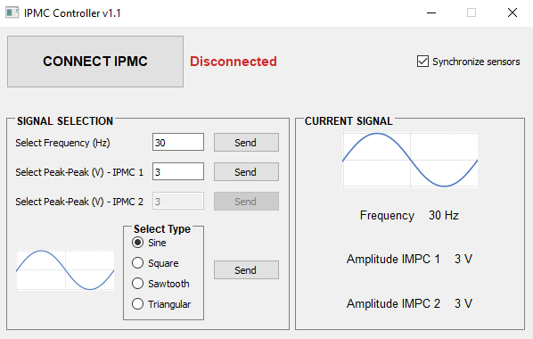

# IPMC Controller 

This project provides a **Graphical User Interface (GUI)** for controlling the actuation electronics of an **IPMC device**.

  

## Features

- **Automatic device detection** by clicking the **"CONNECT IPMC"** button, which scans all available COM ports on the PC.
- **Signal type selection** among:
  - Sinusoidal
  - Rectangular
  - Sawtooth
  - Triangular
- Simultaneous control of **up to two** devices.
- Voltage adjustment between **1 and 20 V**.
- Signal frequency selectable between **0.1 and 30 Hz**.

## 🪟 Windows Executable

The compiled version of the application is located in the `dist` folder:

- Run the `.exe` directly — **no installation required**
- All dependencies are bundled (PyQt5, pyserial, etc.)
